# Market System with Delivery (CLI)

(Using Eclipse Equinox)

## Done By: Eventors 4.0

- [Manoj Kumar](https://github.com/manoj997)
- [Amashi Sandunika](https://github.com/amashi996)
- [Thavananthan](https://github.com/Thavananthan)
- [Bavanraj](https://github.com/Bavanraj-5)

## Table of Contents

- Project Description
- System Flowchart
- System Screenshot
- Manifest Screenshots

## Project Description

### Introduction

- 
We have implemented a Shop and Delivery System using Eclipse Equinox OSGi Framework. Let usexplain this briefly. The system comprises of **Four Producers**: Fruit Shop, Toy Shop, Cloth Shop and Delivery Service and **One Consumer**. The purpose of having only one consumer is that if more than one consumer bundles are implemented, all the consumer bundles will be behaving in the same way which will be a duplicate implementation of consumer bundles. The IDE used was Eclipse and written on Java programing language.

### Implementation

- 
We First, when the consumer bundle is started, the system will prompt the user whether the user
  wishes for a delivery service. If so, consumer is asked for the distance between delivery location
  and the shop. If the distance exceeds 2km, additional charges will apply. Then the system prompts
  the user to select a shop and then selects an item to buy and quantity to buy. After the user
  finishes the purchases in a shop, he/she can purchase in another shop. At the end of each
  purchase, an invoice will be printed and after the end of all purchase, a final invoice will be printed
  as well. If there are any delivery charges are added by user at the beginning, those charges will
  also be added to the final invoice.

FOR BETTER UNDERSTANDING, A FLOWCHART FOR THE SYSTEM HAS BEEN SHOWN BELOW.

## System Flowchart

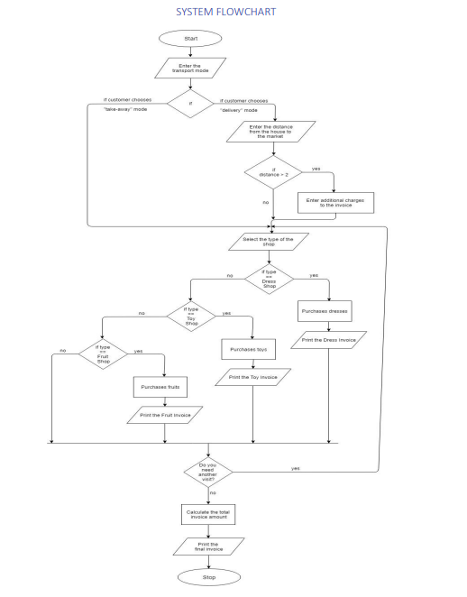

## System Screenshots

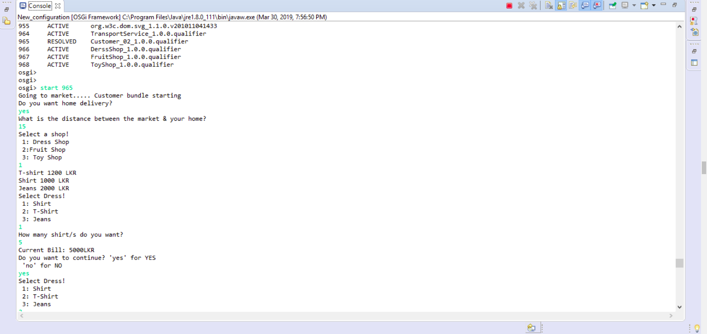

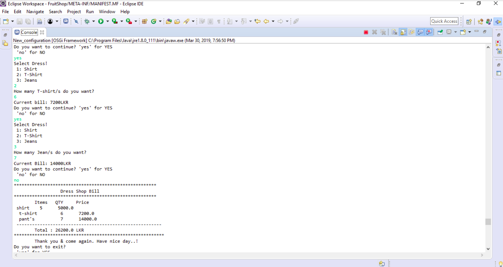

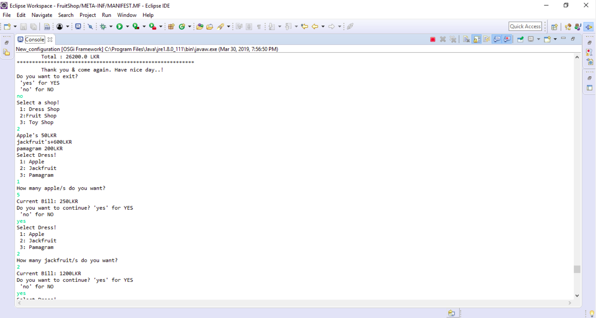

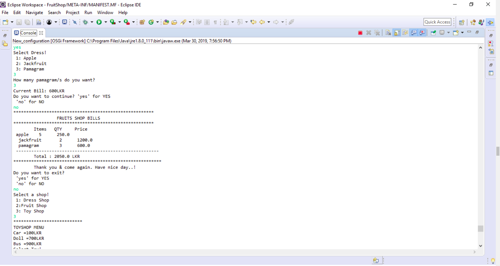

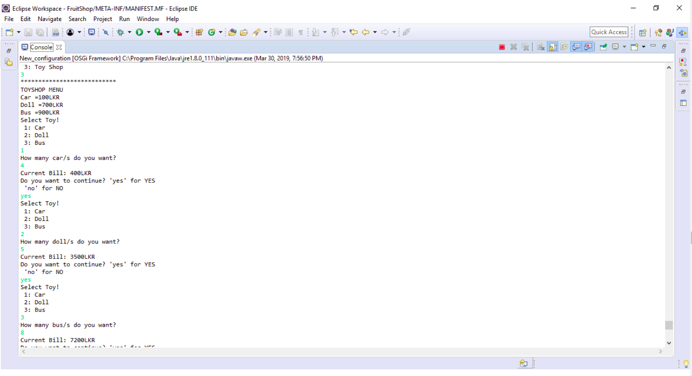

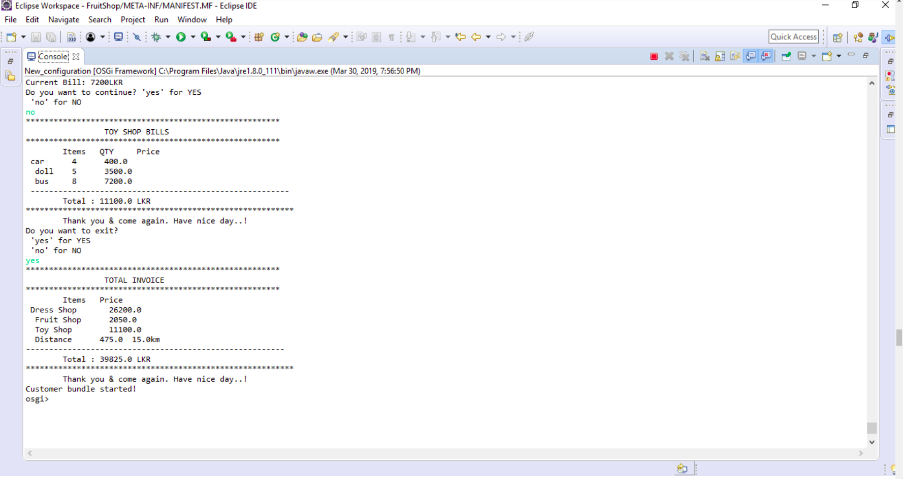

## Manifest Screenshots

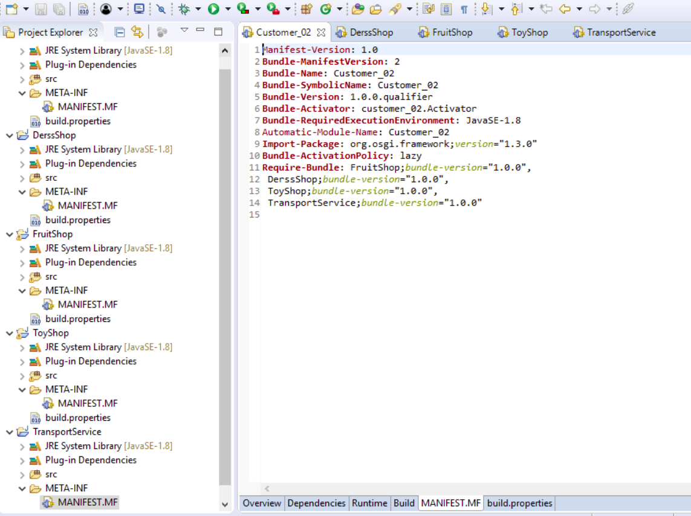

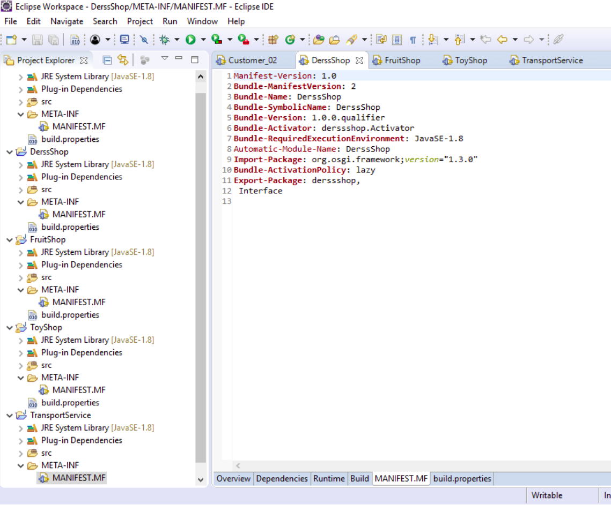

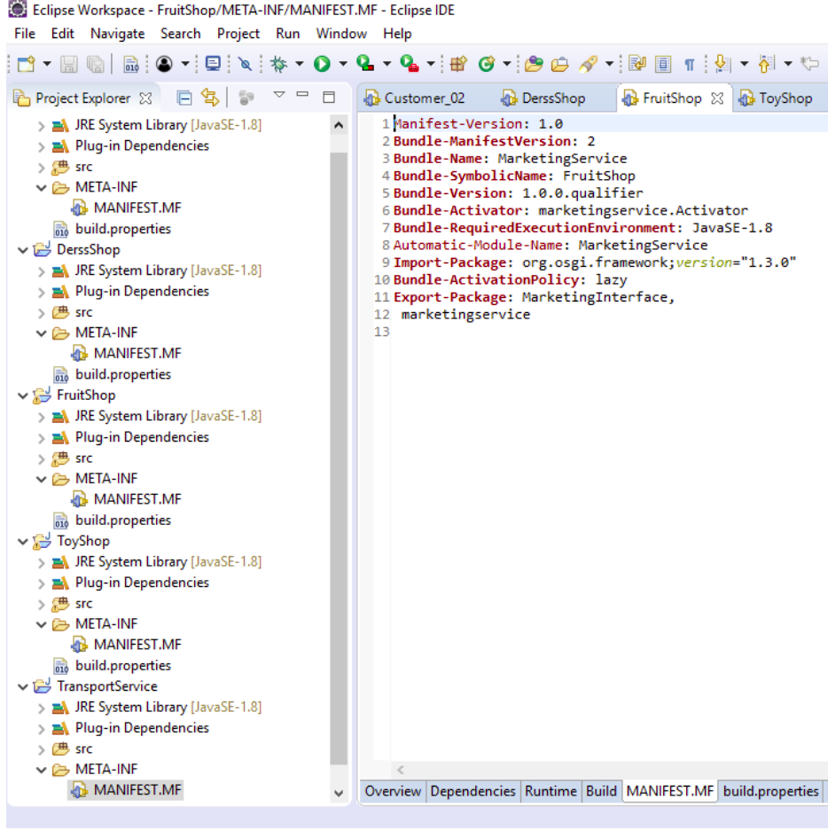

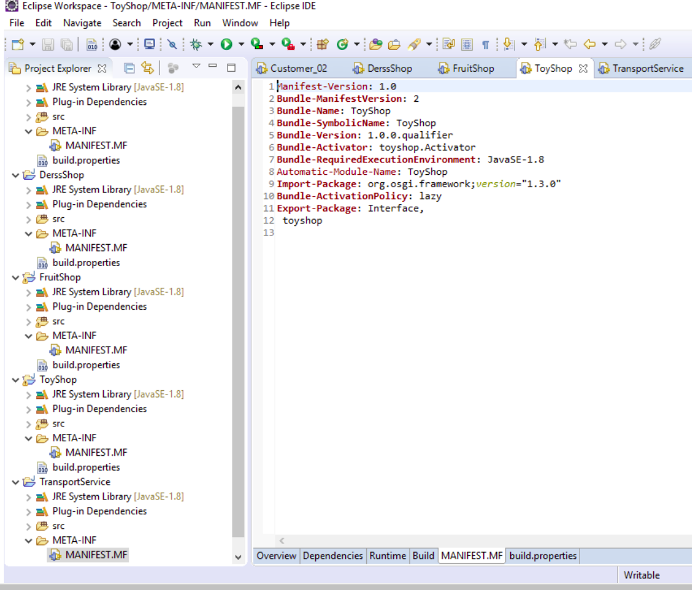
